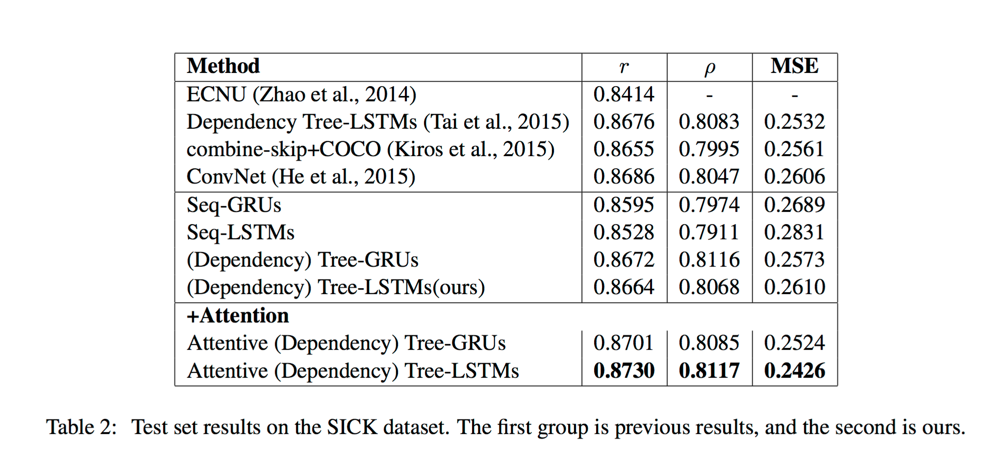
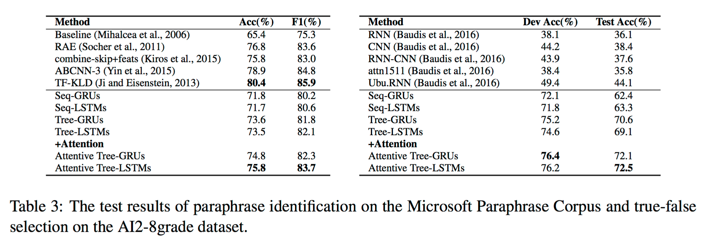
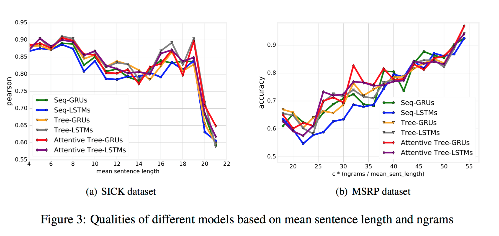

#Sentpair

The implementation of our paper **Modeling Sentence Pairs with Tree-structured Attentive Encoder**[(pdf)](https://yoosan.me/static/sentpair.pdf) to appear at the *COLING2016*. It runs both training and evaluation. Note that we just test the projects on Mac OS X and Ubuntu 14.

##Preparing

You can download the preprocessed data (recommend) from [here](https://github.com/yoosan/sentpair/releases/download/predata/data.zip). Alternatively you can process them by yourself. The original links are:

+ [SICK dataset](http://clic.cimec.unitn.it/composes/sick.html)
+ [MSRP dataset](https://www.microsoft.com/en-us/download/details.aspx?id=52398)
+ [AI2-8grade dataset]()

##Requirement
The software can run on CPU or GPU, dependency requirements are following:

+ torch7
+ python

The package should be installed are the following. For example, you can install the ``nn`` package by ``luarocks install nn``. 

+ ``luarocks install nn``
+ ``luarocks install nngraph``
+ ``luarocks install optim``
+ ``luarocks install xlua``
+ ``luarocks install sys``
+ ``luarocks install lfs``
+ ``luarocks install cutorch``
+ ``luarocks install cunn``

##Running

To run our models, you can tap the command 

``
th main.lua -<opt_name> opt_value -<opt_name> opt_val ...
``

For example, to run the model on the SICK dataset, you should tap

``
th main.lua -task MSRP -structure atreelstm -lr 0.05 -n_epoches 10
``

more details in the file ``main.lua``.

##Results

We achieve the results as 






##Bib
```
@inproceedings{zhou2016sentpair,
    title={Modelling Sentence Pairs with Tree-structured Attentive Encoder},
    author={Yao Zhou, Cong Liu and Yan Pan},
    booktitle={The International Conference on Computational Linguistics (COLING)},
    year={2016}
}
```

##License
MIT
